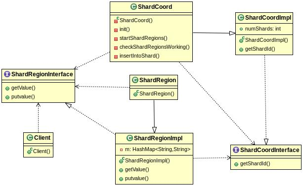

## Assignment 3

### How to Run and test?
- Compile all source files using ```javac *.java```
- The ShardCoord is responsible for running all ShardRegion instances.
- Run RMI registry using ```rmiregistry &```.
- Run ShardCoord using ```java ShardCoord number_of_shards``` Replace ```number_of_shards``` with the number of shards you want to create here. Let it run for sometime and insert data from csv file into the shards. When it says that the records have been inserted into the shards, move on to next step.
- Create a new terminal tab using Ctrl+Shift+T.
- Create the test cases using ```java CreateTestCases```. This will create the input and output for the test cases in input/ and output/ directories respectively using a single threaded program from the given sheet.
- Run the test cases using ```java RunTestCases number_of_shards```. Replace ```number_of_shards``` with the number of shards we created earlier. This will create the current output of a test case in cur_output/ directory. It will then diff the contents of files in output/ and cur_output/ to see if correct result is being produced and will prompt if all test cases have passed or not.
- 50 clients are being initiated by RunTestCases. We can change this in the program acccordingly.

### Pseudocode for getValue
```
getValue(key)
{
    if (key exists in local hashmap m)
        return corresponding value.
    else
        shardId = get shard id where this key could exist from shardCoord.
        if (shardId == myShardId)
            return ""
        else
            send a request to shardId Shard and get the value.
            if (found in shardId)
                return the value
            else
                return "";
}
```

### Pseudocode for putvalue
```
putvalue(key, value, force)
if (force == 1)
    insert <key, value> into local hashmap m.
else
    shardId = get shard id where this <key,value> should be stored from shardCoord.
    if (shardId == myShardId)
        insert <key, value> into local hashmap m.
    else
        send a request to shardId Shard and put the <key,value> in its hashmap with force=1.
```

### UML Class Diagram
UML Diagram is in uml.jpg.


### Test Cases
```input/``` and ```output/``` contain the correct input and output test cases.
Test cases in ```cur_output/``` are generated by our implementation and are compared with test cases in ```/output/``` to see if our implementation is correct or not.

### Optional
I have attempted optional part (c). The ShardCoord is a global singleton and it instantiates the ShardRegions.